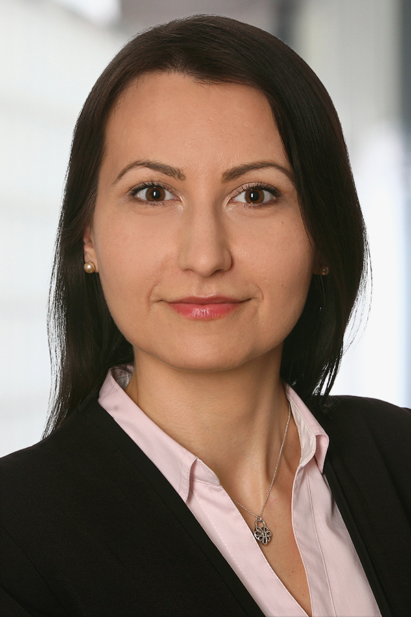
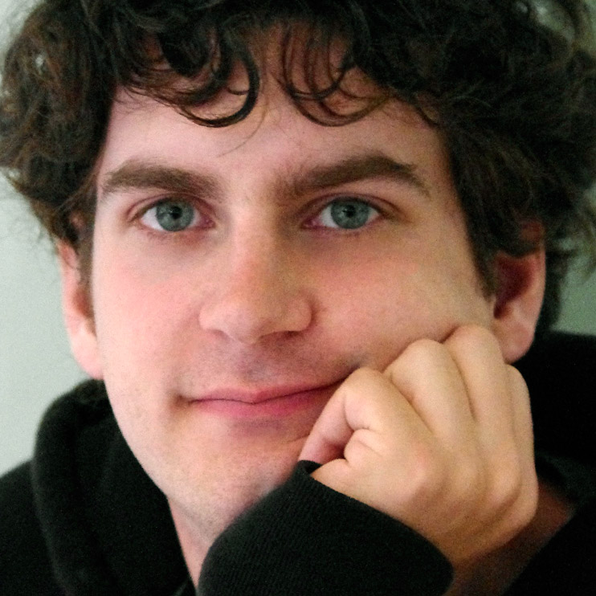
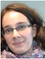

# Organisers
* Maria Maleshkova - Karlsruhe Institute of Technology, Germany
* Ruben Verborgh - Ghent University – imec, Belgium
* Amelie Gyrard - Ecole des Mines de Saint-Etienne, France

Dr. Maria Maleshkova is a postdoctoral researcher at the Karlsruhe Service Research Institute (KSRI) and the Institute of Applied Informatics and Formal Description Methods (AIFB) at the Karlsruhe Institute of Technology. Her research work covers Web of Things (WoT) and semantics-based data integration topics, as well as work in the area of the semantic description of Web APIs, RESTful services and their joint use with Linked Data. Prior to that she was a Research Associate and a PhD student at the Knowledge Media Institute (KMi) at the Open University, where she worked on projects in the domain of SOA and Web Services.

Ruben Verborgh is a researcher in semantic hypermedia at Ghent University - imec, Belgium and a postdoctoral fellow of the Research Foundation Flanders. He explores the connection between Semantic Web technologies and the Web’s architectural properties, with the ultimate goal of building more intelligent clients. Along the way, he became fascinated by Linked Data, REST/hypermedia, Web APIs, and related technologies. He’s a co-author of two books on Linked Data, and has contributed to more than 200 publications for international conferences and journals on Web-related topics.

Dr. Amelie Gyrard is a post-doc researcher at Ecole des Mines de Saint- Etienne, France, working within the Connected Intelligence - Knowledge Representation and Reasoning team. Previously, she was a postdoc at Insight Center for Data Analytics, National University of Galway and actively working in the scientific development and coordination of the FIESTA-IoT (Federated Interoperable Semantic IoT/Cloud Testbeds and Applications) EU H2020 project. Her research interests are on Software engineering for Semantic Web of Things and Internet of Things (IoT), semantic web best practices and methodologies, ontology engineering, reasoning and interoperability of IoT data. She holds a Ph.D. from Eurecom since April 2015 where she designed and implemented the Machine-to-Machine Measurement (M3) framework. She also disseminated her work in standardizations such as ETSI M2M, oneM2M, and W3C Web of Things.

# Program Committee
* Kjetil Kjernsmo, University of Oslo, Norway
* Andreas Harth, KIT, Germany
* Jacek Kopecký, University of Portsmouth, UK
* Peter Haase, metaphacts, Germany
* María-Esther Vidal, Universidad Simón Bolívar
* Tobias Weller, KIT, Germany
* Erik Wilde, UC Berkeley, USA
* Carlos Pedrinaci, KMi, Open University, UK
* Pedro Szekely, University of Southern California, USA
* Jürgen Umbrich, DERI Galway, Ireland
* Armin Haller, CSIRO, Australia
* Lionel Médini, Claude Bernard Lyon University, France
* Thomas Steiner, Google, Germany
* Femke Ongenae, Ghent University – imec, Belgium
* Nandana Mihindukulasooriya, Universidad Politecnica de Madrid, Spain
* Erik Wilde, EMC, USA
* Sebastian Bader, KIT, Germany
* Pierre-Antoine Champin, Claude Bernard Lyon University, France
* Pieter Colpaert, Ghent University – imec, Belgium
* Pramod Anantaram, Kno.e.sis Center,Wright State University, USA
* Marta Sabou, Vienna University of Technology, Austria
* Xiang Su, University of Oulu, Finland
