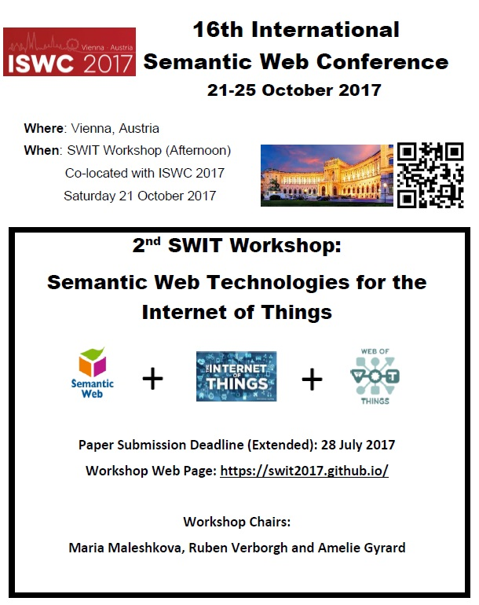

# Program
More info to follow soon.

2nd Workshop Semantic Web Technologies for the Internet of Things (SWIT 2017)

When: Saturday October 21st 2017 - Afternoon

Where: Co-located with [International Semantic Web Conference (ISWC)](https://iswc2017.semanticweb.org/) 2017, Vienna, Austria

Previous Edition:

* [SWIT 2016 co-located with ISWC 2016](https://swit.smartsdk.eu/)

You might be interested by the tutorial in the morning on the same topic:

[Semantic Web meets Internet of Things and Web of Things](http://semantic-web-of-things.appspot.com/?p=ISWC2017Tutorial) Tutorial at ISWC 2017, Vienna, Austria

